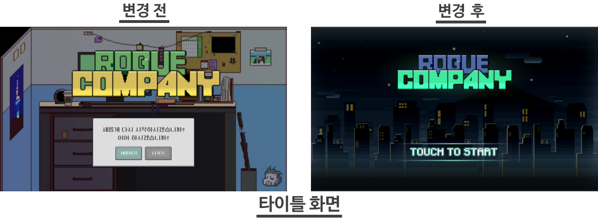
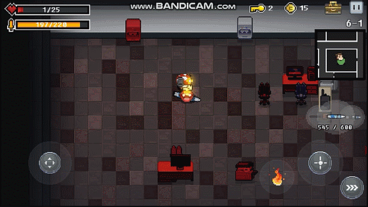
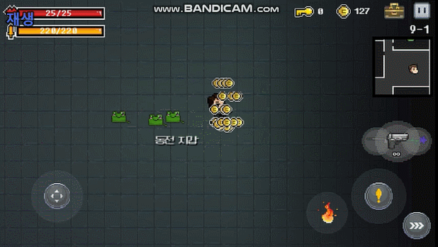
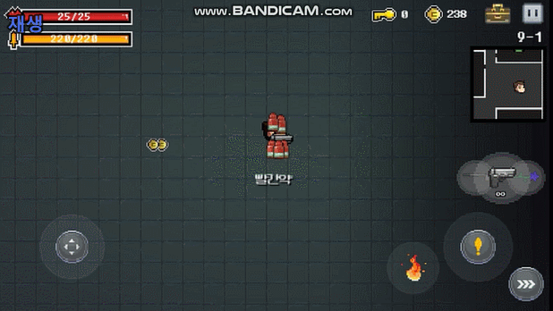
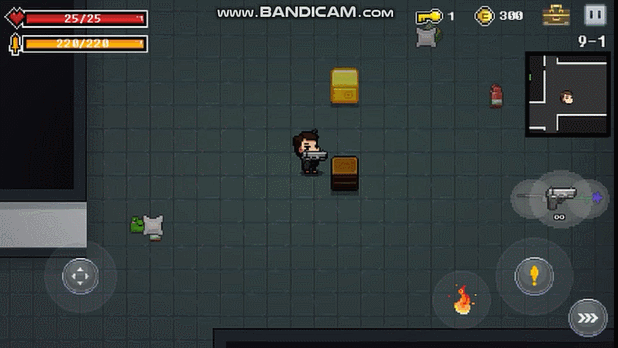

# 프로젝트 명 : 로그 컴퍼니(Rogue Company)

>- Promotion Video : https://www.youtube.com/watch?v=Bu6-mhlF8NQ

## Game Image

 
 
 
 
 
 
 
 
 
 
 
 
 
## About Team
> 팀 슈팅스타는 기획자 2명, 프로그래머 3명, 아트 2명 총 7명으로 구성되어 있습니다.

## About Project

>- 모바일 플랫폼(안드로이드) 2D 로그라이크 슈팅 게임 프로젝트.
>- 유니티(2017.3f)로 클라이언트 개발 진행.
>- 유저 데이터 작업 로컬 binary data로 Save & Load 구현, 이후 파이어베이스나 뒤끝 서비스 같은 백엔드 서비스를 활용하여 바꿀 예정.
>- 초심자와 모바일 조작 편의성을 고려해 자동 조준, 반자동 조준, 수동 조준 기능 구분하여 구현

>- Behavior Tree를 통한 Monster, Boss Monster AI 구현, Unity Editor 기능으로 Editor를 확장하여 Drag & Drop 방식으로 AI 작업 할 수 있도록 Editor 구현.
>- 절차적 맵 생성 기반(Procedural Map Generation)의 각 Stage에 따른 Random Map 구현
>- Map에 등장하여 Player와 상호작용 할 수 있는 여러 오브젝트(문, 부셔지는 오브젝트, 무기 상자, 아이템 상자, 코인 등) 구현

>- 여러가지 아이템(소모품, 버프, 패시브) 구현
>- 근접 무기, 권총, 샷건, 레이저, 수류탄 무기 등 다양한 공격 패턴을 가지는 무기(약 50개 이상) 개발
>- 다양한 각도와 위치의 탄막 패턴 생성을 위해 여러 패턴의 템플릿 Bullet Pattern(MultiDir, Row, Laser, Spread)Class 구현
>- 화상, 빙결, 스턴, 슬로우 등 상태이상 구현
>- 데코레이터 패턴을 참고하여 Bullet Class내의 Property(Collision, Update, Delete Property) Class를 포함하여 Bullet이 여러가지 충돌, 운동, 삭제 속성을 가지도록 구현(몬스터 관통, 벽 오브젝트에 튕겨짐, 가속도 운동, 회전 운동, 유도탄, 총알 삭제 후 파열탄 생성 등)  
>- Parent Bullet을 중심으로 Child Bullet을 생성하여 삼각형, 사각형, 별 모양, +, x, 알파벳 등 특수한 모양의 탄막 패턴 구현, Parent Bullet의 알맞은 UpdateProperty를 추가하여 다양한 운동 궤적을 그릴 수 있도록 구현(등속도, 가속도, 회전, 삼각함수)
>- Excel에서 작업한 무기 데이터 내용 csv으로 만들어 Unity 내에서 csv 파싱 후 WeaponInfo Data에 적용할 수 있도록 구현
>- Trail Renderer, Line Renderer, Particle System을 이용한 무기, 총알 이펙트 제작
>- 콘텐츠 도감(무기, 아이템, 몬스터) 시스템, UI 구현

>- Monster, Bullet, Item, Particle등의 객체를 오브젝트 풀로 만들어 재활용 할 수 있도록 최적화 작업
>- Unity 2D TileMap 사용
>- Scriptable Object 활용 (Weapon, Map, Player, AI 등의 Data 관리) 
>- Sprite Atlas를 통한 리소스 최적화 

## History

>- 18.02.10 Team Building(기획2, 개발3, 아트1 총6명으로 시작, 대학생 게임 개발 연합 동아리 Bridge)
>- 18.06.27 스마일게이트 멤버십(SGM) 창작 부문 10기 최종 선발 및 활동 시작
>- 18.08.23 아트1명 추가 모집(기획2, 개발3, 아트2 총 7명)
>- 19.02.27 Bridge소속으로 참여한 2018 하반기 LINE 전국 대학교 게임개발동아리 공모전 20표 중 9표로 1위 달성, 팀 사정으로 동아리 팀 프로젝트 종료 후 1인 개발 전환
>- 19.04.23 Unity Made With Unity Korea Awards 2019 제출(참가), https://connect.unity.com/p/mwu-korea-2019-rogeukeompeoni-rogue-company-syutingseuta-1 
>- 19.05.30 1인 개발 전환에 따른 Git Repository 변경 : https://github.com/Janghyun-mo/New-RougeCompany (19.12.04 기준 Private Repository, 안드로이드 플랫폼 출시 목표를 위해 개발 진행 중)
